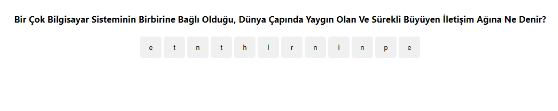
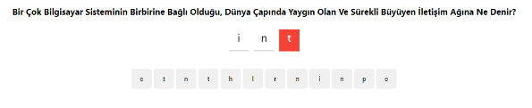
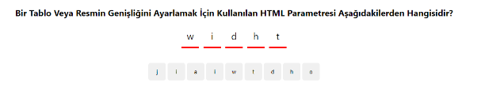
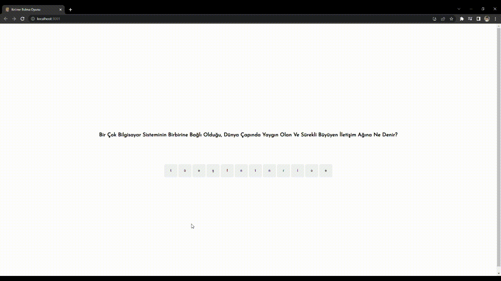

# KELİME BULMACA

## Proje Tanıtımı
* Projemde React kullanarak tek sayfalı bir web uygulaması(SPA) yöntemi ile kelime bulma uygulaması oluşturacağım.Oluşturacağım proje içeriğinde belirlediğim kelimeler ekrana sırasıyla gelecek. Kullanıcı soru esnasında verilen ipucu sayesinde alttaki verilen bir kaç harfle ilişkilendirip doğru kelimeyi bulmaya çalışacak. Doğru kelimeyi ürettiğinde ise yeni kelime hemen ardından gelecektir.

## Projeye Başlangıç
* Projemi oluştururken Visual Studio Code uygulaması kullanacağım. React tabanlı uygulamamı oluşturmak için vs code uygulamamı açıp terminale **npx create-react-app kelime_oyunu** yazarak kullanacağım react dosyalarını oluşturmaya başladım. Dosyalar oluşturulduktan sonra **cd kelime_oyunu** yazarak dosya içerisine girip npm start yazarak local hostu başlattım.
* Başlangıç olarak App.js içerisine oyun sayfamda bulunacak soru başlığı sekmesini ekliyorum. 
* Daha sonrasında kullanacak olduğum soruları sistemde tutmak için src klasörünün içerisine data.js adlı bir dosya oluşturuyorum ve App.js dosyasında kullanabilmek için import ediyorum. 
* **Data.js** dosyasında belirlemiş olduğum soru verilerini kullanmak için **App.js** dosyasına answer ve question adlı değişkenler tanımlayıp **useState** yapısını ve soru verilerini güncellemek için **useEffect** yapısını kullandım.
* Oyunumuzun daha keyifli hale gelebilmesi için kullanıcıya harfleri rastgele vermek istediğimiz için alfabedeki harfleri sisteme değişken olarak atadım.
* Oluşturduğumuz veri içerisindeki sorunun cevabını harf harf ayırmak için bir dizi oluşturdum ve question değişkeniyle bağladım.
* Oyunda zorluk olması amacıyla değişken olarak atadığım alfabe harflerinden rastgele 4 harfi soru anında kullanabilmek için harf harf ayırdığım cevap veri dizisine ekledim.
* Eklemiş olduğumuz 4 harf ve cevap verisindeki harf dizisini karıştırmak için shuffle adlı bir yapı tanımladım ve diziyle bağladım.
* Rastgele belirlediğimiz harfleri ekrana getirip tıklanabilir hale getirmek için **div** sekmesi oluşturup **button** yapısıyla tıklanabilir harfleri oluşturup bastığım harf butonlarının soru yazısının altında listelenmesi için bir metot oluşturdum.
* Harf bloklarına sınırsız tıklayıp oyunun düzenini bozmamak için tıklanan harflerle oluşan kelimenin, cevap harf sayısına eşitlendiğinde harfe tıklanamaz hale getirdim cevap bulunamadıysa cevap yanlış bildirisi ekledim.
* Yanlış tıkladığımız harfleri silebilmemiz için gerekli metotu oluşturdum.
* Tıkladığımız harflerle birlikte doğru cevabı bulduğumuzda **data.js** dosyasında oluşturduğumuz sorulardan bir sonrakine geçmesini sağlayacak **if else** bloğunu oluşturdum. 
* Sorulacak soru kalmadığında hata vermemesi için gerekli ayarlamaları yaptım.
* Tıklanılır harflerin görünümünü ayarlamak için oluşturmuş olduğumuz **button** bloğuna classname atayıp App.css üzerinde gerekli ayarlamaları yapıp tuşlara basıldığında üste aktarılacak harflerin düzenlemesini yaptım.
* Ardından soru başlığındaki yazı boyutunu ve kalınlık ayarlarını yaptım.

* Tıkladığımız harflerin soru altındaki görünümlerini üzerine gelip silmek istediğimizde kırmızıya dönecek şekilde ayarladım.

* Yukarıda belirtmiş olduğum yanlış cevap verilmesi anındaki bildiriyi düzenleyip verilen kullanıcının daha rahat anlayabilmesi için cevap eğer ki yanlış ise harf bloklarının altında kırmızı yanacak şekilde ayarladım.

 
* Data.js içerisinde belirlemiş olduğumuz soruların hepsine doğru cevap verildiğinde ekranımıza “sorular bitti!!” yazısı ekledim.
* Son olarak gerekli css ve yazı stili ayarlamalarını yaptıktan sonra oyunumuzu hazır hale getirdim.

## Oynanış Videosu

